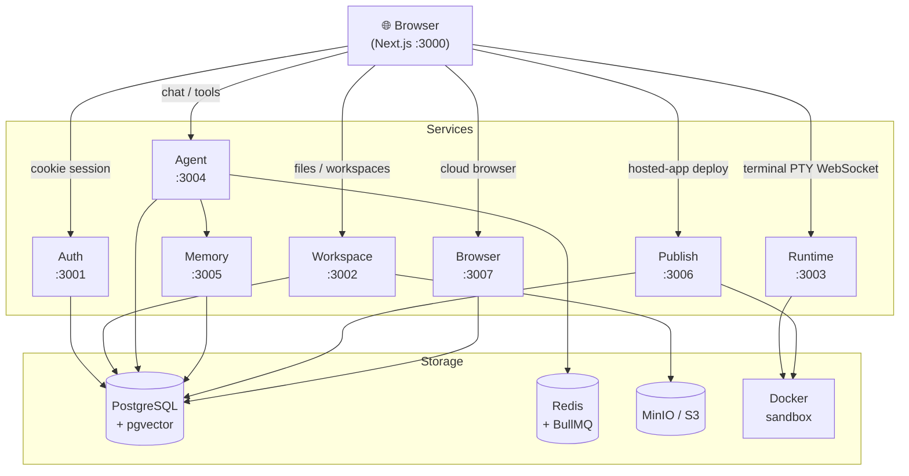

# ☁️ CloudMind OS — Personal AI Cloud Computer

A multi-tenant, browser-based "AI cloud computer" platform. Users get persistent workspaces, an AI agent with tool-calling, a web terminal, file management, automation scheduling, hosting, snapshots, and settings/admin surfaces. The current repo is a Next.js frontend plus independent Fastify services, with infrastructure in Docker Compose.

## Features

| Module          | Description                                                              |
| --------------- | ------------------------------------------------------------------------ |
| **Auth**        | Email/password + Google OAuth, session cookies, rate-limited             |
| **Dashboard**   | Quick-action cards, workspace summary, recent activity                   |
| **Files**       | S3-backed file tree, Monaco editor, drag-drop upload, preview            |
| **AI Chat**     | Streaming responses, tool-call approval UI, multiple providers (BYOK)    |
| **Terminal**    | xterm.js + WebSocket PTY, security policy (strict/balanced/permissive)   |
| **Automations** | BullMQ-scheduled AI tasks (manual/hourly/daily/weekly/cron), run history |
| **Hosting**     | Deploy static sites, Vite apps, or Node APIs via Docker + Traefik        |
| **Snapshots**   | Workspace tar.gz backup to S3, one-click restore with safety backup      |
| **Datasets**    | DuckDB-backed CSV/JSON/Parquet import, read-only SQL playground          |
| **Browser**     | Cloud Playwright sessions per user, agent tools for navigate/extract     |
| **Channels**    | Telegram bot adapter (webhook in, agent out), per-user link mapping      |
| **Settings**    | AES-256-GCM encrypted API keys, theme, terminal policy, danger zone      |
| **Audit Log**   | Per-user history of privileged actions, action filter, retention pruner  |
| **Admin**       | User list, audit logs, system health dashboard                           |

## Tech Stack

- **Frontend:** Next.js 16, React 19, Tailwind v4, shadcn/ui
- **Backend:** 7 independent Fastify v4 microservices (TypeScript)
- **Database:** PostgreSQL 16 (pgvector) via Drizzle ORM
- **Queue:** BullMQ + Redis 7
- **Storage:** MinIO (S3-compatible)
- **Proxy:** Traefik v3
- **Container Runtime:** Docker / Dockerode

## Quick Start

### Prerequisites

- Node.js 20+
- pnpm 9+
- Docker + Docker Compose

### 1. Install & Setup

```bash
git clone <repo>
cd personal-cloud-platform
pnpm install

# Environment
cp infra/docker/.env.example infra/docker/.env
# Edit .env for real deployments. ENCRYPTION_KEY must be exactly 32 bytes.
```

### 2. Start Infrastructure

```bash
pnpm infra:up
# Starts: PostgreSQL, Redis, MinIO, Traefik, Mailhog
```

### 3. Run Migrations & Seed

```bash
pnpm --filter @pcp/db migrate
pnpm --filter @pcp/db seed    # idempotent: creates Sandbox workspace, skills, datasets, hosted services, automations
# Optional: create real DuckDB tables for sample datasets
# pnpm --filter @pcp/workspace-service add @duckdb/node-api && pnpm --filter @pcp/db seed
```

### 4. Start Services

```bash
# In separate terminals (or use a process manager)
pnpm --filter @pcp/auth-service dev        # :3001
pnpm --filter @pcp/workspace-service dev   # :3002
pnpm --filter @pcp/runtime-service dev     # :3003
pnpm --filter @pcp/agent-service dev       # :3004
pnpm --filter @pcp/memory-service dev      # :3005
pnpm --filter @pcp/publish-service dev     # :3006
pnpm --filter @pcp/browser-service dev     # :3007
pnpm --filter web dev                      # :3000

# Or fan out everything in parallel:
pnpm dev
```

### 5. Open

- **App:** http://localhost:3000
- **Traefik Dashboard:** http://localhost:8080
- **MinIO Console:** http://localhost:9001
- **Mailhog:** http://localhost:8025

## Baseline Smoke

```bash
pnpm smoke:local
```

For an infrastructure-backed local run:

```bash
cp infra/docker/.env.example infra/docker/.env
pnpm infra:up
pnpm --filter @pcp/db migrate

curl -fsS http://localhost:3001/health
curl -fsS http://localhost:3002/health
curl -fsS http://localhost:3003/health
curl -fsS http://localhost:3004/health
curl -fsS http://localhost:3005/health
curl -fsS http://localhost:3006/health
```

## Project Structure

## Architecture



## Repo Layout

```
.
├── apps/
│   └── web/              # Next.js 16 frontend (App Router)
├── services/
│   ├── auth/             # Auth, OAuth, session, admin        :3001
│   ├── workspace/        # Files, S3, snapshots, DuckDB       :3002
│   ├── runtime/          # Terminal PTY, WebSocket            :3003
│   ├── agent/            # AI chat, tools, skills, automations :3004
│   ├── memory/           # Vector memory (pgvector)           :3005
│   ├── publish/          # Docker-hosted services             :3006
│   └── browser/          # Cloud Playwright sessions          :3007
├── packages/
│   ├── db/               # Drizzle schema, migrations, seed
│   └── shared/           # Zod DTOs (no build step)
├── infra/
│   └── docker/           # docker-compose.yml, postgres init
├── scripts/              # backup.sh, restore.sh, seed-* utilities
└── docs/                 # BUILD_PLAN.md, PRODUCTION.md, PROGRESS.md
```

## Environment Variables

| Variable               | Required | Description                                      |
| ---------------------- | -------- | ------------------------------------------------ |
| `DATABASE_URL`         | ✅       | PostgreSQL connection string                     |
| `REDIS_URL`            | ✅       | Redis connection string                          |
| `S3_ENDPOINT`          | ✅       | MinIO/S3 endpoint                                |
| `S3_ACCESS_KEY`        | ✅       | S3 access key                                    |
| `S3_SECRET_KEY`        | ✅       | S3 secret key                                    |
| `COOKIE_SECRET`        | ✅       | Session cookie signing secret                    |
| `ENCRYPTION_KEY`       | ✅       | 32-byte key for AES-256-GCM (API key encryption) |
| `ADMIN_EMAIL`          | ⚡       | Email of admin user (gates /admin routes)        |
| `GOOGLE_CLIENT_ID`     | ⚡       | Google OAuth client ID                           |
| `GOOGLE_CLIENT_SECRET` | ⚡       | Google OAuth client secret                       |

## Testing

```bash
# Root smoke check: typecheck, lint where configured, and tests where configured
pnpm smoke:local

# Type checking all packages with typecheck scripts
pnpm typecheck

# Per-package example
pnpm --filter @pcp/workspace-service test
pnpm --filter @pcp/workspace-service exec vitest run src/service.test.ts
```

## Security Model

- **Authentication:** Argon2 password hashing, HTTP-only session cookies
- **API Key Encryption:** AES-256-GCM with random IV per key; plaintext never stored/logged
- **Rate Limiting:** `@fastify/rate-limit` on all services (100 req/min default, 5 req/min for login/register)
- **Path Traversal:** Central `assertSafePath()` guard on all file operations (blocks `..`, null bytes, `~`)
- **Tenant Isolation:** All DB queries filter by `user_id`; S3 paths are tenant-prefixed
- **Terminal Policy:** Configurable risk levels (strict/balanced/permissive) with command blocklist
- **Admin Access:** `ADMIN_EMAIL` env var gates admin routes (MVP; upgrade to role column for production)

## Roadmap

See [docs/BUILD_PLAN.md](docs/BUILD_PLAN.md) and [docs/PROGRESS.md](docs/PROGRESS.md) for the current build plan and progress.

## License

TBD
